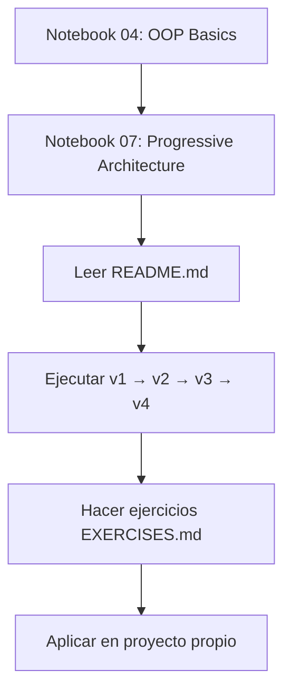
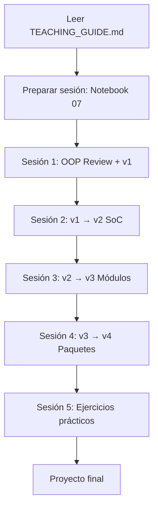

# Índice Completo: Material de Arquitectura Progresiva

## 📚 Documentación Principal

| Archivo | Propósito | Para Quién | Tiempo |
|---------|-----------|------------|--------|
| [README.md](README.md) | Visión general y guía de uso | Estudiantes | 10 min |
| [TEACHING_GUIDE.md](TEACHING_GUIDE.md) | Guía pedagógica completa | Profesores | 30 min |
| [VISUAL_SUMMARY.md](VISUAL_SUMMARY.md) | Resumen visual con diagramas | Estudiantes/Profesores | 15 min |
| [QUICK_COMPARISON.md](QUICK_COMPARISON.md) | Tabla comparativa rápida | Estudiantes | 5 min |
| [EXERCISES.md](EXERCISES.md) | Cuaderno de ejercicios | Estudiantes | 3-4 h |
| **Este archivo** | Índice navegable | Todos | 2 min |

## 🎓 Material de Enseñanza

### Notebooks Jupyter

| Notebook | Tema | Prerrequisito | Duración |
|----------|------|---------------|----------|
| [../04-oop_basics.ipynb](../04-oop_basics.ipynb) | POO: Clases y objetos | Funciones | 2 h |
| [../modules/07_progressive_architecture.ipynb](../modules/07_progressive_architecture.ipynb) | Arquitectura progresiva | OOP | 2 h |

### Código de Ejemplo (4 Versiones)

| Versión | Archivos | Concepto Clave | Líneas |
|---------|----------|----------------|--------|
| [v1_monolithic/](v1_monolithic/) | `bank.py` | Todo en una clase | ~150 |
| [v2_functional/](v2_functional/) | `bank.py` | Funciones separadas (SoC) | ~180 |
| [v3_modular/](v3_modular/) | `bank.py`, `validators.py` | Módulos (DRY) | ~220 |
| [v4_package/](v4_package/) | `bank.py`, `validators/` | Paquete (SRP) | ~250 |

## 🎯 Rutas de Aprendizaje

### Para Estudiantes Nuevos



**Pasos detallados:**

1. **Día 1: Fundamentos (2-3h)**
   - [ ] Lee [../04-oop_basics.ipynb](../04-oop_basics.ipynb)
   - [ ] Completa ejercicios del notebook OOP
   - [ ] Verifica que entiendes: clases, objetos, métodos, `self`

2. **Día 2: Arquitectura (2-3h)**
   - [ ] Lee [../modules/07_progressive_architecture.ipynb](../modules/07_progressive_architecture.ipynb)
   - [ ] Lee [README.md](README.md) de este directorio
   - [ ] Lee [VISUAL_SUMMARY.md](VISUAL_SUMMARY.md)

3. **Día 3: Práctica (2-3h)**
   - [ ] Ejecuta cada versión: `python v1_monolithic/bank.py`, etc.
   - [ ] Compara código entre versiones
   - [ ] Usa [QUICK_COMPARISON.md](QUICK_COMPARISON.md) como referencia

4. **Día 4-5: Ejercicios (3-4h)**
   - [ ] Completa [EXERCISES.md](EXERCISES.md)
   - [ ] Empieza con ejercicio 1 (análisis)
   - [ ] Progresa hasta ejercicio 6 (aplicación completa)

5. **Día 6: Aplicación (variable)**
   - [ ] Identifica un proyecto tuyo para refactorizar
   - [ ] Aplica los principios aprendidos
   - [ ] Documenta el proceso

### Para Profesores



**Preparación:**

1. **Antes de clase (1h)**
   - [ ] Lee [TEACHING_GUIDE.md](TEACHING_GUIDE.md) completo
   - [ ] Revisa [../modules/07_progressive_architecture.ipynb](../modules/07_progressive_architecture.ipynb)
   - [ ] Ejecuta todas las versiones para verificar que funcionan

2. **Plan de sesiones (5 sesiones de 2h)**
   - Sesión 1: Introducción + v1
   - Sesión 2: Principio SoC + v2
   - Sesión 3: Módulos + MOD-97 + v3
   - Sesión 4: Paquetes + SRP + v4
   - Sesión 5: Ejercicios prácticos

3. **Material de apoyo**
   - Proyectar [VISUAL_SUMMARY.md](VISUAL_SUMMARY.md) en clase
   - Distribuir [QUICK_COMPARISON.md](QUICK_COMPARISON.md) como referencia
   - Asignar [EXERCISES.md](EXERCISES.md) como tarea

### Para Revisión Rápida

**¿Necesitas recordar...?**

| Tema | Consulta |
|------|----------|
| Diferencias entre versiones | [QUICK_COMPARISON.md](QUICK_COMPARISON.md) |
| Principios (DRY, SoC, SRP) | [VISUAL_SUMMARY.md](VISUAL_SUMMARY.md) |
| Algoritmo MOD-97 | [v3_modular/validators.py](v3_modular/validators.py) líneas 30-50 |
| Estructura de `__init__.py` | [v4_package/validators/__init__.py](v4_package/validators/__init__.py) |
| Cuándo refactorizar | [QUICK_COMPARISON.md](QUICK_COMPARISON.md) sección "Señales" |

## 📁 Mapa del Proyecto

```
bank_evolution/
│
├── 📄 README.md                    ← Empieza aquí
├── 📄 INDEX.md                     ← Este archivo
├── 📘 TEACHING_GUIDE.md            ← Para profesores
├── 📊 VISUAL_SUMMARY.md            ← Diagramas y resúmenes
├── 📋 QUICK_COMPARISON.md          ← Referencia rápida
├── 📝 EXERCISES.md                 ← Ejercicios prácticos
│
├── 📂 v1_monolithic/
│   └── bank.py                     ← Todo en uno
│
├── 📂 v2_functional/
│   └── bank.py                     ← Funciones separadas
│
├── 📂 v3_modular/
│   ├── bank.py                     ← Clase principal
│   └── validators.py               ← Módulo (con MOD-97)
│
└── 📂 v4_package/
    ├── bank.py                     ← Clase principal
    └── validators/                 ← Paquete
        ├── __init__.py             ← Exportaciones
        ├── iban.py                 ← Validación IBAN
        └── amount.py               ← Validación cantidades
```

## 🔍 Buscar por Concepto

### Arquitectura

| Concepto | Dónde encontrarlo |
|----------|-------------------|
| Monolítico | [v1_monolithic/bank.py](v1_monolithic/bank.py) |
| Funcional | [v2_functional/bank.py](v2_functional/bank.py) |
| Modular | [v3_modular/](v3_modular/) |
| Paquete | [v4_package/](v4_package/) |

### Principios

| Principio | Explicación | Ejemplo |
|-----------|-------------|---------|
| **DRY** | [VISUAL_SUMMARY.md](VISUAL_SUMMARY.md#principios) | v2 → v3 |
| **SoC** | [VISUAL_SUMMARY.md](VISUAL_SUMMARY.md#principios) | v1 → v2 |
| **SRP** | [VISUAL_SUMMARY.md](VISUAL_SUMMARY.md#principios) | v3 → v4 |

### Validaciones

| Tipo | Implementación |
|------|----------------|
| Solo formato (regex) | v1, v2 |
| Formato + checksum MOD-97 | v3, v4 |
| Algoritmo MOD-97 explicado | [v3_modular/validators.py](v3_modular/validators.py) |

### Python Específico

| Concepto Python | Dónde verlo |
|-----------------|-------------|
| Módulos (import) | v3 |
| Paquetes (directorios) | v4 |
| `__init__.py` | [v4_package/validators/__init__.py](v4_package/validators/__init__.py) |
| `__all__` | [v4_package/validators/__init__.py](v4_package/validators/__init__.py) |
| Properties (`@property`) | Todas las versiones |
| Custom Exceptions | Todas las versiones |

## 🚀 Comandos Útiles

### Ejecutar todas las versiones

```bash
# Desde el directorio bank_evolution/
python v1_monolithic/bank.py
python v2_functional/bank.py
python v3_modular/bank.py
python v4_package/bank.py
```

### Probar módulos independientemente

```bash
# v3
python v3_modular/validators.py

# v4
python -m v4_package.validators.iban
python -m v4_package.validators.amount
```

### Comparar archivos

```bash
# Linux/Mac
diff v1_monolithic/bank.py v2_functional/bank.py
diff v3_modular/validators.py v4_package/validators/iban.py

# Windows PowerShell
Compare-Object (Get-Content v1_monolithic/bank.py) (Get-Content v2_functional/bank.py)
```

## 📊 Estadísticas del Material

| Métrica | Valor |
|---------|-------|
| Archivos de código Python | 9 |
| Archivos de documentación | 6 |
| Notebooks Jupyter | 2 |
| Líneas de código total | ~800 |
| Líneas de documentación | ~3000 |
| Ejercicios prácticos | 7 |
| Tiempo estimado aprendizaje | 10-15 horas |
| Nivel | Intermedio |

## 🎯 Objetivos de Aprendizaje

Al completar este material, serás capaz de:

- [ ] Identificar código que necesita refactorización
- [ ] Aplicar principios DRY, SoC y SRP
- [ ] Organizar código en funciones, módulos y paquetes
- [ ] Crear paquetes Python con `__init__.py`
- [ ] Implementar validaciones complejas (IBAN MOD-97)
- [ ] Decidir cuándo usar cada arquitectura (v1 vs v2 vs v3 vs v4)
- [ ] Refactorizar código existente progresivamente

## 💡 Consejos de Uso

### Para estudio individual

1. **No saltes pasos**: Cada versión construye sobre la anterior
2. **Escribe el código**: No solo leas, implementa
3. **Haz los ejercicios**: La práctica es esencial
4. **Aplica a tus proyectos**: La mejor forma de aprender

### Para clase

1. **Live coding**: Muestra la refactorización en vivo
2. **Debates**: ¿Cuándo refactorizar? ¿Qué versión usar?
3. **Proyectos en equipo**: Que refactoricen código real
4. **Code reviews**: Revisen código de otros aplicando principios

## 🔗 Enlaces Externos Útiles

- [Python Modules Documentation](https://docs.python.org/3/tutorial/modules.html)
- [IBAN Validation Algorithm](https://en.wikipedia.org/wiki/International_Bank_Account_Number#Validating_the_IBAN)
- [SOLID Principles](https://en.wikipedia.org/wiki/SOLID)
- [Clean Code Book](https://www.amazon.com/Clean-Code-Handbook-Software-Craftsmanship/dp/0132350882)

## ❓ Preguntas Frecuentes

**P: ¿Debo empezar siempre con v1?**
R: Sí, para proyectos pequeños. Pero si ya sabes que será grande, empieza con v3.

**P: ¿Es v4 siempre mejor?**
R: No. Para scripts pequeños, v4 es sobre-ingeniería. Usa la versión apropiada.

**P: ¿Cómo sé cuándo refactorizar?**
R: Consulta [QUICK_COMPARISON.md](QUICK_COMPARISON.md) sección "Señales de que Necesitas Evolucionar".

**P: ¿Funciona para otros lenguajes?**
R: Los principios (DRY, SoC, SRP) son universales. La sintaxis cambia.

**P: ¿Qué pasa si mi código ya es v2?**
R: Estudia v3 y v4 para ver cómo organizarlo mejor.

## 📝 Feedback y Contribuciones

Este material es didáctico. Si encuentras errores o mejoras:

1. Abre un issue en el repositorio
2. Propón cambios con ejemplos claros
3. Sugiere ejercicios adicionales

---

**Última actualización**: Diciembre 2025
**Versión**: 1.0
**Mantenedor**: Material didáctico CSPy

**¡Feliz aprendizaje de arquitectura de software!** 🚀
