# Full Index: Progressive Architecture Material

## 📚 Main Documentation

| File | Purpose | Target Audience | Time |
|------|---------|-----------------|------|
| [README.md](README.md) | Overview and usage guide | Students | 10 min |
| [TEACHING_GUIDE.md](TEACHING_GUIDE.md) | Complete pedagogical guide | Teachers | 30 min |
| [VISUAL_SUMMARY.md](VISUAL_SUMMARY.md) | Visual summary with diagrams | Students/Teachers | 15 min |
| [QUICK_COMPARISON.md](QUICK_COMPARISON.md) | Quick comparison table | Students | 5 min |
| [EXERCISES.md](EXERCISES.md) | Exercises notebook | Students | 3-4 h |
| **This file** | Navigable index | Everyone | 2 min |

## 🎓 Teaching Material

### Jupyter Notebooks

| Notebook | Topic | Prerequisite | Duration |
|----------|-------|--------------|----------|
| [../04-oop_basics.ipynb](../04-oop_basics.ipynb) | OOP: Classes and objects | Functions | 2 h |
| [../modules/07_progressive_architecture.ipynb](../modules/07_progressive_architecture.ipynb) | Progressive architecture | OOP | 2 h |

### Example Code (4 Versions)

| Version | Files | Key Concept | Lines |
|---------|-------|-------------|-------|
| [v1_monolithic/](v1_monolithic/) | `bank.py` | All in one class | ~150 |
| [v2_functional/](v2_functional/) | `bank.py` | Separate functions (SoC) | ~180 |
| [v3_modular/](v3_modular/) | `bank.py`, `validators.py` | Modules (DRY) | ~220 |
| [v4_package/](v4_package/) | `bank.py`, `validators/` | Package (SRP) | ~250 |

## 🎯 Learning Paths

### For New Students

```mermaid
graph TD
    A[Notebook 04: OOP Basics] --> B[Notebook 07: Progressive Architecture]
    B --> C[Read README.md]
    C --> D[Run v1 → v2 → v3 → v4]
    D --> E[Do exercises EXERCISES.md]
    E --> F[Apply in own project]
```



**Detailed steps:**

1. **Day 1: Fundamentals (2-3h)**
   - [ ] Read [../04-oop_basics.ipynb](../04-oop_basics.ipynb)
   - [ ] Complete exercises in OOP notebook
   - [ ] Verify you understand: classes, objects, methods, `self`

2. **Day 2: Architecture (2-3h)**
   - [ ] Read [../modules/07_progressive_architecture.ipynb](../modules/07_progressive_architecture.ipynb)
   - [ ] Read [README.md](README.md) in this directory
   - [ ] Read [VISUAL_SUMMARY.md](VISUAL_SUMMARY.md)

3. **Day 3: Practice (2-3h)**
   - [ ] Run each version: `python v1_monolithic/bank.py`, etc.
   - [ ] Compare code between versions
   - [ ] Use [QUICK_COMPARISON.md](QUICK_COMPARISON.md) as reference

4. **Day 4-5: Exercises (3-4h)**
   - [ ] Complete [EXERCISES.md](EXERCISES.md)
   - [ ] Start with exercise 1 (analysis)
   - [ ] Progress up to exercise 6 (full application)

5. **Day 6: Application (variable)**
   - [ ] Identify a project of yours to refactor
   - [ ] Apply learned principles
   - [ ] Document the process

### For Teachers

```mermaid
graph TD
    A[Read TEACHING_GUIDE.md] --> B[Prepare session: Notebook 07]
    B --> C[Session 1: OOP Review + v1]
    C --> D[Session 2: v1 → v2 SoC]
    D --> E[Session 3: v2 → v3 Modules]
    E --> F[Session 4: v3 → v4 Packages]
    F --> G[Session 5: Practical exercises]
    G --> H[Final project]
```



**Preparation:**

1. **Before class (1h)**
   - [ ] Read [TEACHING_GUIDE.md](TEACHING_GUIDE.md) completely
   - [ ] Review [../modules/07_progressive_architecture.ipynb](../modules/07_progressive_architecture.ipynb)
   - [ ] Run all versions to verify they work

2. **Session Plan (5 sessions of 2h)**
   - Session 1: Introduction + v1
   - Session 2: SoC Principle + v2
   - Session 3: Modules + MOD-97 + v3
   - Session 4: Packages + SRP + v4
   - Session 5: Practical exercises

3. **Support Material**
   - Project [VISUAL_SUMMARY.md](VISUAL_SUMMARY.md) in class
   - Distribute [QUICK_COMPARISON.md](QUICK_COMPARISON.md) as reference
   - Assign [EXERCISES.md](EXERCISES.md) as homework

### For Quick Review

**Need to remember...?**

| Topic | Check |
|-------|-------|
| Differences between versions | [QUICK_COMPARISON.md](QUICK_COMPARISON.md) |
| Principles (DRY, SoC, SRP) | [VISUAL_SUMMARY.md](VISUAL_SUMMARY.md) |
| MOD-97 Algorithm | [v3_modular/validators.py](v3_modular/validators.py) lines 30-50 |
| `__init__.py` structure | [v4_package/validators/__init__.py](v4_package/validators/__init__.py) |
| When to refactor | [QUICK_COMPARISON.md](QUICK_COMPARISON.md) section "Signals" |

## 📁 Project Map

```
bank_evolution/
│
├── 📄 README.md                    ← Start here
├── 📄 INDEX.md                     ← This file
├── 📘 TEACHING_GUIDE.md            ← For teachers
├── 📊 VISUAL_SUMMARY.md            ← Diagrams and summaries
├── 📋 QUICK_COMPARISON.md          ← Quick reference
├── 📝 EXERCISES.md                 ← Practical exercises
│
├── 📂 v1_monolithic/
│   └── bank.py                     ← All in one
│
├── 📂 v2_functional/
│   └── bank.py                     ← Separate functions
│
├── 📂 v3_modular/
│   ├── bank.py                     ← Main class
│   └── validators.py               ← Module (with MOD-97)
│
└── 📂 v4_package/
    ├── bank.py                     ← Main class
    └── validators/                 ← Package
        ├── __init__.py             ← Exports
        ├── iban.py                 ← IBAN validation
        └── amount.py               ← Amount validation
```

## 🔍 Search by Concept

### Architecture

| Concept | Where to find it |
|---------|------------------|
| Monolithic | [v1_monolithic/bank.py](v1_monolithic/bank.py) |
| Functional | [v2_functional/bank.py](v2_functional/bank.py) |
| Modular | [v3_modular/](v3_modular/) |
| Package | [v4_package/](v4_package/) |

### Principles

| Principle | Explanation | Example |
|-----------|-------------|---------|
| **DRY** | [VISUAL_SUMMARY.md](VISUAL_SUMMARY.md#principles) | v2 → v3 |
| **SoC** | [VISUAL_SUMMARY.md](VISUAL_SUMMARY.md#principles) | v1 → v2 |
| **SRP** | [VISUAL_SUMMARY.md](VISUAL_SUMMARY.md#principles) | v3 → v4 |

### Validations

| Type | Implementation |
|------|----------------|
| Format only (regex) | v1, v2 |
| Format + MOD-97 checksum | v3, v4 |
| MOD-97 algorithm explained | [v3_modular/validators.py](v3_modular/validators.py) |

### Specific Python Concepts

| Python Concept | Where to see it |
|----------------|-----------------|
| Modules (import) | v3 |
| Packages (directories) | v4 |
| `__init__.py` | [v4_package/validators/__init__.py](v4_package/validators/__init__.py) |
| `__all__` | [v4_package/validators/__init__.py](v4_package/validators/__init__.py) |
| Properties (`@property`) | All versions |
| Custom Exceptions | All versions |

## 🚀 Useful Commands

### Run all versions

```bash
# From bank_evolution/ directory
python v1_monolithic/bank.py
python v2_functional/bank.py
python v3_modular/bank.py
python v4_package/bank.py
```

### Test modules independently

```bash
# v3
python v3_modular/validators.py

# v4
python -m v4_package.validators.iban
python -m v4_package.validators.amount
```

### Compare files

```bash
# Linux/Mac
diff v1_monolithic/bank.py v2_functional/bank.py
diff v3_modular/validators.py v4_package/validators/iban.py

# Windows PowerShell
Compare-Object (Get-Content v1_monolithic/bank.py) (Get-Content v2_functional/bank.py)
```

## 📊 Material Statistics

| Metric | Value |
|--------|-------|
| Python code files | 9 |
| Documentation files | 6 |
| Jupyter Notebooks | 2 |
| Total lines of code | ~800 |
| Documentation lines | ~3000 |
| Practical exercises | 7 |
| Estimated learning time | 10-15 hours |
| Level | Intermediate |

## 🎯 Learning Objectives

By completing this material, you will be able to:

- [ ] Identify code that needs refactoring
- [ ] Apply DRY, SoC, and SRP principles
- [ ] Organize code into functions, modules, and packages
- [ ] Create Python packages with `__init__.py`
- [ ] Implement complex validations (IBAN MOD-97)
- [ ] Decide when to use each architecture (v1 vs v2 vs v3 vs v4)
- [ ] Refactor existing code progressively

## 💡 Usage Tips

### For individual study

1. **Don't skip steps**: Each version builds on the previous one
2. **Write the code**: Don't just read, implement
3. **Do the exercises**: Practice is essential
4. **Apply to your projects**: The best way to learn

### For class

1. **Live coding**: Show refactoring live
2. **Debates**: When to refactor? Which version to use?
3. **Team projects**: Refactor real code
4. **Code reviews**: Review others' code applying principles

## 🔗 Useful External Links

- [Python Modules Documentation](https://docs.python.org/3/tutorial/modules.html)
- [IBAN Validation Algorithm](https://en.wikipedia.org/wiki/International_Bank_Account_Number#Validating_the_IBAN)
- [SOLID Principles](https://en.wikipedia.org/wiki/SOLID)
- [Clean Code Book](https://www.amazon.com/Clean-Code-Handbook-Software-Craftsmanship/dp/0132350882)

## ❓ FAQ

**Q: Should I always start with v1?**
A: Yes, for small projects. But if you already know it will be large, start with v3.

**Q: Is v4 always better?**
A: No. For small scripts, v4 is over-engineering. Use the appropriate version.

**Q: How do I know when to refactor?**
A: Check [QUICK_COMPARISON.md](QUICK_COMPARISON.md) section "Signals you need to evolve".

**Q: Does it work for other languages?**
A: The principles (DRY, SoC, SRP) are universal. Syntax changes.

**Q: What if my code is already v2?**
A: Study v3 and v4 to see how to organize it better.

## 📝 Feedback and Contributions

This material is educational. If you find errors or improvements:

1. Open an issue in the repository
2. Propose changes with clear examples
3. Suggest additional exercises

---

**Last update**: December 2025
**Version**: 1.0
**Maintainer**: CSPy educational material

**Happy software architecture learning!** 🚀
